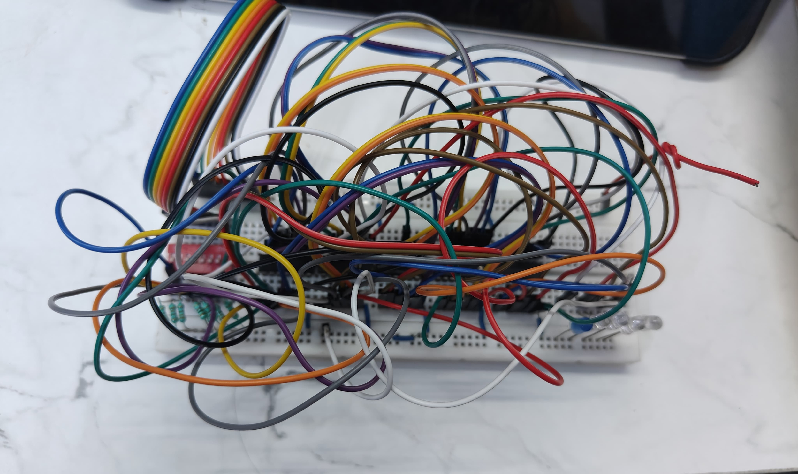
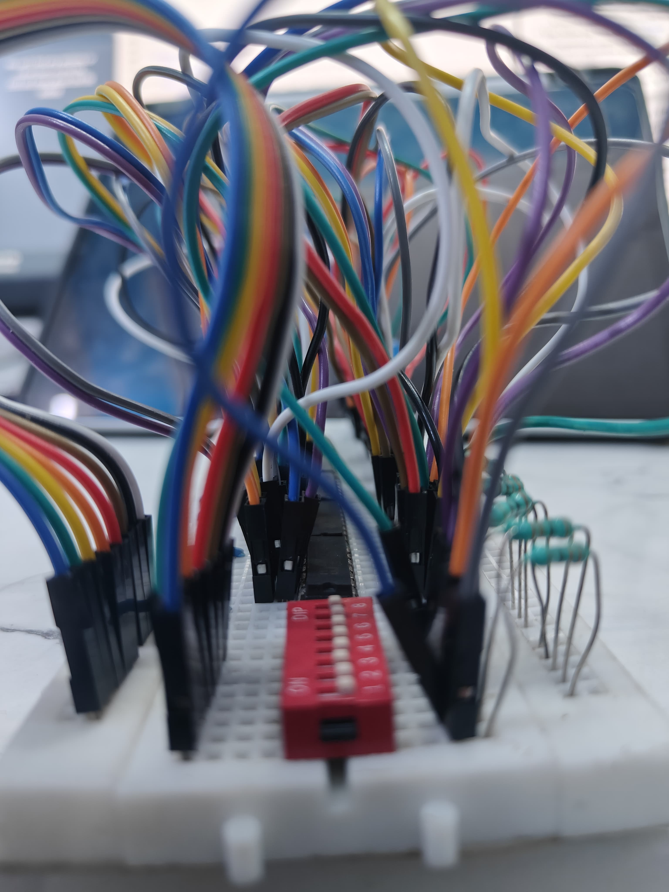
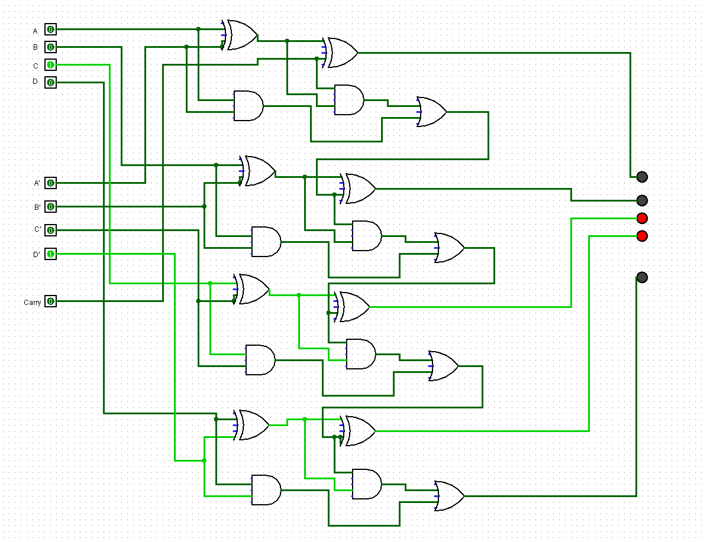

# 4-Bit Full Adder Using Logic Gates on Breadboard

This project demonstrates a **4-bit full adder circuit** implemented entirely with basic logic gate ICs: **74HC86 (XOR), 74HC08 (AND), and 74HC32 (OR)**. The full adder design is built and tested on a breadboard to perform binary addition of two 4-bit numbers along with a carry-in input.

## Abstract

The goal of this project was to construct a hardware-based 4-bit binary adder using only fundamental logic gates, avoiding pre-built adder ICs. The adder was implemented using three ICs:

- `74HC86`: Quad 2-input XOR Gate
- `74HC08`: Quad 2-input AND Gate
- `74HC32`: Quad 2-input OR Gate

The resulting adder takes two 4-bit binary inputs (**A3-A0**, **B3-B0**) and a carry-in (**Cin**), and outputs a 4-bit sum (**S3-S0**) along with a carry-out (**Cout**).

---

## Components Used

| Component        | Quantity | Description                            |
|------------------|----------|----------------------------------------|
| 74HC86           | 2        | Quad XOR gate                          |
| 74HC08           | 2        | Quad AND gate                          |
| 74HC32           | 1        | Quad OR gate                           |
| LEDs             | 5       | For indicating Sum and Carry outputs   |
| DIP Switches     | 8        | For inputting A3–A0, B3–B0, and Cin     |
| Breadboard       | 1        | Solderless breadboard for prototyping  |
| Jumper Wires     | Many     | For interconnections                   |
| Power Supply     | 1        | 9V regulated DC                        |
| Resistors (220Ω) | 8| For current limiting to LEDs           |

---

## Theory

A **1-bit full adder** takes three inputs: A, B, and Carry-in, and produces two outputs: Sum and Carry-out.

### Boolean Equations:
- **Sum** = A ⊕ B ⊕ Cin
- **Cout** = (A AND B) OR (Cin AND (A ⊕ B))

To construct a **4-bit adder**, we cascade four 1-bit full adders. The Carry-out of each stage connects to the Carry-in of the next stage.

---

## Circuit Design

The adder is structured as follows:

1. **XOR gates** are used to compute intermediate sums.
2. **AND gates** calculate the carry generate terms.
3. **OR gates** are used to combine carry outputs.
4. **Each bit** uses:
   - 2 XOR gates
   - 2 AND gates
   - 1 OR gate

---

## 🔬 Observations

- The outputs for each bit are displayed using LEDs.
- Inputs are set using DIP switches.
- Propagation delay is noticeable due to gate delays but acceptable for educational purposes.
- Ensures functional correctness for all 2⁹ (512) input combinations through manual testing or input cycling.

---

## 📸 Images

## 📸 Images

### 🔌 Breadboard Setup (Top View)

### 📐 Breadboard Setup (Side View)

### 🧾 Logic Circuit Schematic

---

## 💭 Discussion

This project demonstrates how digital addition can be implemented from scratch using basic gate-level logic. It forms the foundation of understanding how Arithmetic Logic Units (ALUs) work in processors.

Benefits of the project include:
- Hands-on learning of logic gate behavior
- Practical understanding of combinational logic
- Insight into ripple carry adder design

Limitations:
- Delay in carry propagation (ripple effect)
- Scalability is limited due to manual wiring complexity

---

